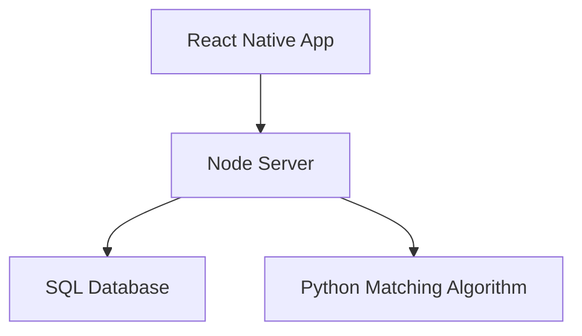

# Welcome to HealthNavigator
<p float="left" align="center">


</p>
An Android & IOS App to help first generation immigrants navigate the complex US Healthcare Process. Work sponsored by the Asian Institute Crane House & the University of Louisville. 


# Installing & Using the Codebase
To run the codebase in dev mode please run 

```
npm run dev 
```

This runs the server, whcih provides API endpoints for user authentication, database CRUD operations & endpoints to access the matching algorithm, concurrently with the android front-end.
If you would like to run the IOS app, you can change the dev script in ``` package.json ``` with 

```
...
  "scripts": {
     ...
    "dev": "concurrently \"npm run server\" \"npm run ios\"",
     ...
  },

```
# Technical Architecture 

The app is written in React Native, MySQL is used for the database, Node is used for the server and python is used to write the matching algorithm. The following is a depiction of 



# React Native App 

The ```src``` folder contains each of the screens in the app. Associated with each screen is an ```index.js``` file which exports the React component to the App. ```StackNavigator``` is used for navigation and is available in ```app.navigator.js```. Each screen is written as a functional component. Each sub-component in a screen is broken down into modular components, making fxes to a given sub-component easy. The following are the screens of the apps

<p float="left" align="center">


</p>
<p float="left" align="center">


</p> 

# APIs 

## User Authentication 
  - **signin-auth**: Takes a username and password as input and outputs a success token representing whether the user is a valid user. It also returns the user_id and first_name and returns back the username and password
## CRUD 
  - **user-add**: Adds a user to the database 
  - **lang-add**: Adds all user languages to database. This should be called right after **user-add** as it needs a valid ID. 
  - **get-language**: Fetches all languages corresponding to a particular user 
  - **api** (renamed to **get-provider-info**): Fetches First Name, Last Name, Address and Experience of the provider's reccomended by the algorithm
## Algorithm 
  - **algo-output**: Creates a seperate process to run the algorithm. After algorithm is run, the IDs of the providers reccomended along with analytics such as 
    the language and distance score is given as output. Requires the desired service and the patient ID as input

# SQL Database

  ## Schema (Primary Key *italicized*)
  - **USER_INFO** : *ID*, FName, MName, LName, DOB, Sex, ONationality, Address, Username, Password
  - **SERVICE_PROVIDER**: *Provider_ID*, *Service_Type*, Experience 
  - **REQUIRED_SERVICES**: *ID*, Service_Name
  - **LANGUAGES_SPOKEN**: *ID*, *Language_Spoken*, Profi_Level
  ## Constraints
    FOREIGN KEY(ID) REFERENCES USER_INFO(ID)    
    FOREIGN KEY(Provider_ID) REFERENCES USER_INFO(ID)
    FOREIGN KEY(ID) REFERENCES USER_INFO(ID) // In LANGUAGES_SPOKEN 
    
# Secrets 

This application requires the username and password to the Production/Test SQL database as well as a [Google Geocoder API key](https://developers.google.com/maps/documentation/geocoding/get-api-key). 

    
# Matching Algorithm 

Uses a variety of factors, such as languages spoken, distance to the user etc., to recommend the best providers for the speciality requested. This algorithm is called by the Node server through a ```spawn``` operation where all parameters to the algorithm are inputted. In the python algorithm, parameters can be accessed through the ```sys``` module as follows 

```sys.argv[0]```

After the operation is done, the outputs should be printed to the console and flushed as below 

```sys.stdout.flush()```

# Future Steps 

Feel free to add a PR if you would like to add on it!

- **Matching Algorithm Scaling** : Currently, the matching algorithm takes time proportional to the amount of providers corresponding to the speicialty type that the user requested. This can be potentially problematic as the app scales. Since this is a CPU-bound task, multiprocessing will be a good choice for parralel computing. In addition, since it is likely that certain pairs of addresses will be inputed more than others, a HashMap that stores the distance between two addresses can be used to reduce the computation. Specifically, whenever a request to compute distances/get lat-long coordinates is done, it will first check the HashMap and if it is not their then only move on to the computation. After the computation is done, add the distance corresponding to the pair in the HashMap. This, can help make common address pairs done in constant time
  
- **Hosting** : If the app is released into production, the server will likely need to be hosted in the cloud, either through Google Cloud, AWS etc. 
# Known Bugs 

None at this time. If you encounter bugs when using the app, please add an issue. 


